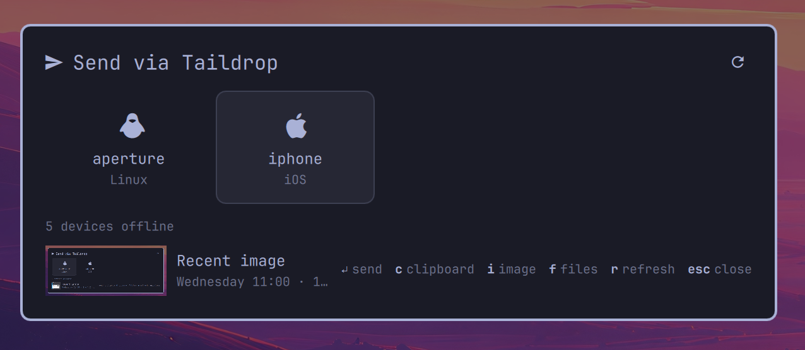

# Taildrop for Omarchy

A share sheet for [Tailscale Taildrop](https://tailscale.com/kb/1106/taildrop):
press a key, pick a device, and whatever you had highlighted, copied, or
selected in Nautilus lands on it.

Tailscale ships a share-menu extension for macOS but nothing like it for
Linux, and LocalSend does not get along with Tailscale (devices vanish from
its list; you end up typing IPs). This plugin is the substitute: Taildrop
already knows every device on your tailnet, works across networks, and needs
no pairing.



## What it sends

| How you open it | What's loaded |
|---|---|
| `SUPER + SHIFT + T` with text highlighted | the highlighted text, as `clipboard.txt` |
| `SUPER + SHIFT + T` with an image on the clipboard | the image, as `clipboard.png` (or `.jpg`/`.webp`) |
| `SUPER + SHIFT + T` otherwise | clipboard text, as `clipboard.txt` |
| right-click files in Nautilus → **Send with Taildrop** | those files |
| `f` inside the sheet | files from the system chooser |

Inside the sheet: arrows / Tab move between devices, **Enter** sends,
**c** switches to the clipboard (ignoring any stale highlight), **f** opens
the file chooser, **r** refreshes the device list, **Esc** closes. Offline
devices are shown dimmed and light up when they come online; the list
refreshes on its own while the sheet is open.

Send-only. Receiving is already handled by Omarchy's
`omarchy-tailscale-receive` service, which drops incoming files into
`~/Downloads` and notifies you.

## Install

```bash
omarchy plugin add https://github.com/ryenski/omarchy-taildrop.git --enable
~/.config/omarchy/plugins/io.github.ryenski.taildrop/install.sh
```

`omarchy plugin add` installs and enables the overlay; it never runs plugin
code, so the two extras are a separate step. `install.sh` copies the Nautilus
menu item into `~/.local/share/nautilus-python/extensions/` and prints the
keybind lines to add to `~/.config/hypr/bindings.lua`:

```lua
o.bind("SUPER + SHIFT + T", "Send via Taildrop", "omarchy-shell shell toggle io.github.ryenski.taildrop")
hl.layer_rule({ match = { namespace = "omarchy-taildrop" }, no_anim = true, animation = "none" })
```

Requirements: `tailscale` on `PATH` with the operator set to your user
(`sudo tailscale set --operator=$USER`), Taildrop enabled for the tailnet,
`wl-clipboard`, `jq`, and `nautilus-python` for the context-menu item.
Progress percentages need util-linux `script` (present on Omarchy).

## Remove

```bash
~/.config/omarchy/plugins/io.github.ryenski.taildrop/install.sh --remove
omarchy plugin remove io.github.ryenski.taildrop
```

and delete the two lines from `bindings.lua`.

## How it works

`Taildrop.qml` is an `overlay` plugin for the Omarchy shell. It shells out to
`send.sh`, which does the parts that are easier to test from a terminal:

```
send.sh stage-clipboard [--no-primary]   → JSON describing what was staged
send.sh send --target <dns> <file>...    → tab-separated progress lines, a notification
send.sh pick [--target <dns>]            → file chooser, then re-summons the overlay
```

Devices come from `tailscale status --json`, using Tailscale's own
`TaildropTarget` grade: 1 is selectable, 5 is shown offline, anything else
(another owner, no Taildrop support) is hidden.

## Develop

```bash
git clone https://github.com/ryenski/omarchy-taildrop.git ~/Work/omarchy-taildrop
cd ~/Work/omarchy-taildrop
./dev.sh link        # symlink into ~/.config/omarchy/plugins and rescan
omarchy plugin enable io.github.ryenski.taildrop
./dev.sh summon      # or with a payload: ./dev.sh summon '{"files":["/etc/hostname"]}'
./dev.sh reload      # after editing QML: restarts the shell (~1s)
./dev.sh validate && ./dev.sh lint
```

The shell caches compiled QML for the life of its process, so edits only
show up after `dev.sh reload` (`omarchy-restart-shell`). Never run
`omarchy plugin update` while linked.

## License

MIT. `Model.js` includes helpers from Omarchy's first-party Tailscale widget,
also MIT.
